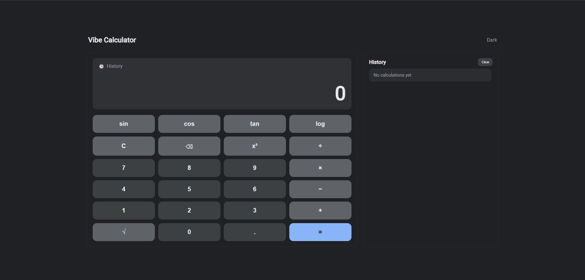

# Vibe Calculator

A modern, dark-mode scientific calculator built using **Vibe Coding** techniques.



## Description

This project explores the capabilities of AI-powered *vibe coding* tools. It features a fully functional scientific calculator with a **physical device aesthetic**, **calculation history tracking**, and **advanced trigonometry logic**.

## Features

- **Scientific Functions:** Support for `sin`, `cos`, `tan`, `log`, square root, and exponents.
- **History Sidebar:** Tracks the last 10 calculations. Clicking a history item re-uses the result.
- **Smart Logic:** Trigonometry functions work in **Degrees** (standard human use) rather than radians.
- **Physical UI:** A clean, flat design inspired by physical scientific calculators.

## Technologies Used

- HTML5
- CSS3 (Grid & Flexbox)
- JavaScript (ES6)
- **Vibe Tool:** Cursor (AI Composer)

## Installation & Setup

1. Clone the repository:

   ```bash
   git clone [https://github.com/eminyilmaz00/vibe-calculator.git](https://github.com/eminyilmaz00/vibe-calculator.git)